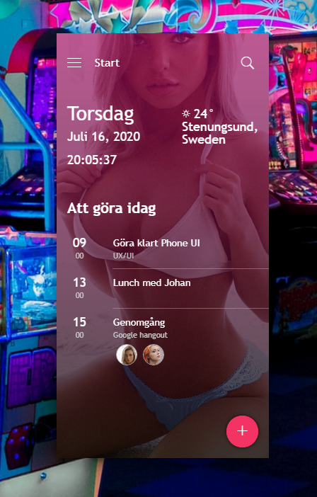

# Mobile Phone User Interface

This is a basic excercise in UI/UX I did, just for fun really. It uses mostly HTML5 and CSS along with some JavaScript and jQuery for the interaction parts. This user interface can be used in any way you like, you could use it in a game and just add extra JavaScript for functionality or for whatever purpose you want.

## Resources in this project
The following resources were used in this project. 

- <a href="https://www.google.com/fonts/specimen/Roboto" target="_blank">roboto</a> for typography
- <a href="https://jquery.com" target="_blank">jquery</a> for interaction UX.
- <a href="http://ionicons.com/" target="_blank">ionicons</a> for icons
- <a href="http://uifaces.co/" target="_blank">ui faces</a> for avatar
- <a href="https://daneden.github.io/animate.css/" target="_blank">animate.css</a> for animation
- <a href="https://unsplash.com/" target="_blank">unsplash.com</a> for background images
				

## Screenshot
